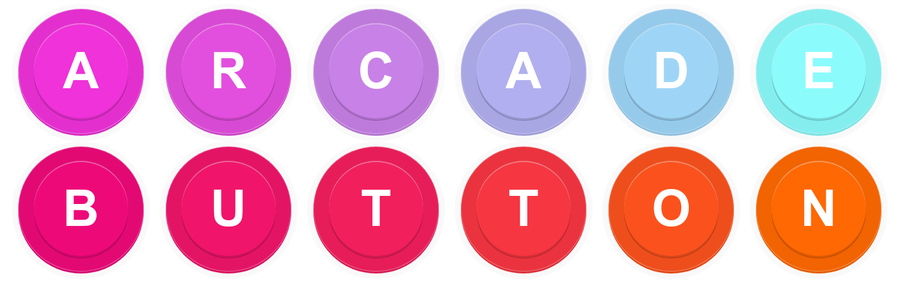

[](https://travis-ci.org/likethemammal/react-native-arcade-button)
[](https://coveralls.io/github/likethemammal/react-native-arcade-button?branch=master)

likethemammal/react-native-arcade-button
=========

[Live Demo (CodeSandbox)](https://codesandbox.io/s/1rk8r5j1z4)




## Installation

```sh
npm i --save react-native-arcade-button
```

### Usage

```jsx
import React from 'react';

class Foo extends React.Component {

  onClick = (e) => {
    //...some code
  }

  render() {
    return (
      <ArcadeButton
        onPressOut={this.onClick}
      >
        <Text>Click</Text>
      </ArcadeButton>
    );
  }
}

```

### Props

| name        | type           | default  | desc 
--- | --- | --- | --- |
| onPressOut | func | null | Function called when button is released |
| onPressIn | func | null | Function called when button press in |
| onDisabledOut | func | null | When `disabled`, this function is called when button is pressed anyway |
| disabled | bool | false | Disables the button presses, will call `onDisabledOut` when press anyway for user experience use cases |
--- | --- | --- | --- |
| *children* | Component | false | Traditional React `children` passed along to label to button. Can be text, icons, etc. |
